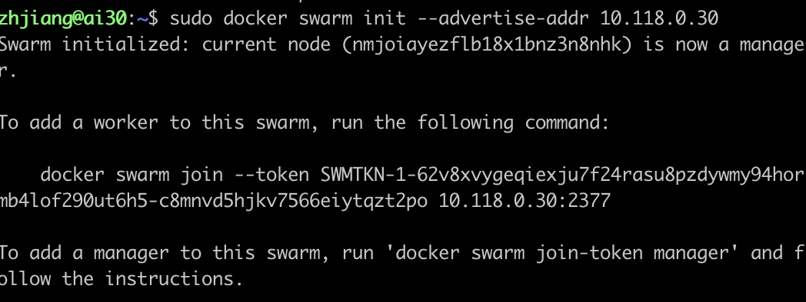
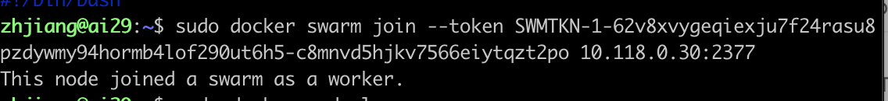
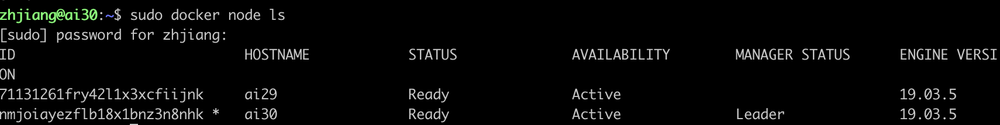
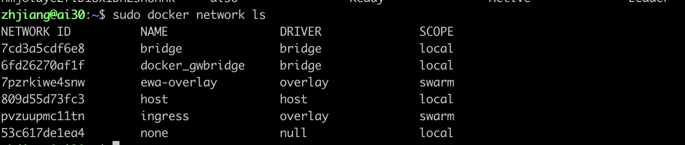
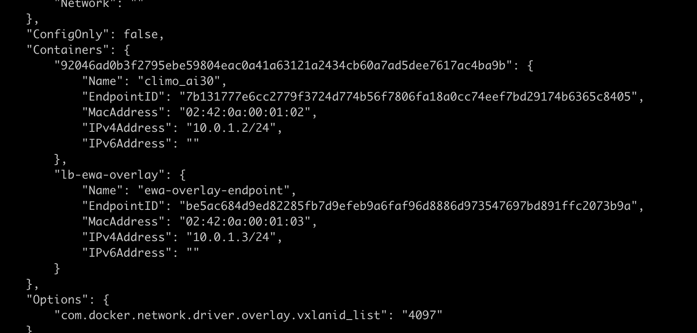
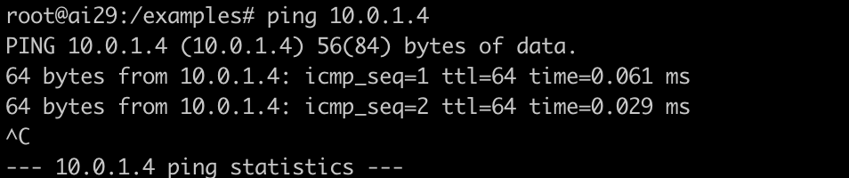
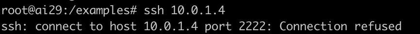

### Introduction

HPC AI500 V3.0 is a  benchmarking tool for HPC AI systems. More details can refers to our paper: https://www.sciencedirect.com/science/article/pii/S2772485922000709.

### Data Sampling

The purpose of data sampling is to generate the bootstrapped data for each training job. We provide a reference implementation of data sampling. Users can customize their own data sampling policies. 

### Workloads Deployment

We adpot Extreme weather analysis and Image Classfication as our default workloads. The deployment of these two workloads are both docker based. More details can refers to the dir ./workloads .

#### Communication between Dockers

Considering the case that a job may require multiple dockers across the nodes. We use Docker swarm and overlay network to manage the communications between the dockers. Here provides an example across two nodes.

##### Docker Swarm and Overlay Network

Purpose: Manage the docker containers across multiple hosts.

###### Prerequisite

1. All nodes should be running in the same docker version.
2. All your nodes will need to be able to communicate with one another.
3. Disable firewall.

###### Simple Example

| Hosts name | IP address  |
| ---------- | ----------- |
| ai29       | 10.118.0.29 |
| ai30       | 10.118.0.30 |

We are going to make the containers on these two nodes  can communicate.

###### Steps

1. Init a swarm maneger. After this command, ai30 become the manager of this swarm.
2. Copy the following command as the token is complicated.`docker swarm join --token SWMTKN-1-62v8xvygeqiexju7f24rasu8pzdywmy94hormb4lof290ut6h5-c8mnvd5hjkv7566eiytqzt2po 10.118.0.30:2377`

  Then login to ai29 run this command.
  
As you can see, this node joined the target swarm and become a worker.

3. On the manager node (ai30), you can use `docker node ls` to check the container cluster status.
   
4. Then we should create an overlay network.
   
5. We can check this network by `docker network ls`.
   
6. Next, we are supposed to run our docker containers (climo_ai29 and climo_ai30) in this network by using `--network` parameter.

   `sudo docker run --gpus all \ --ipc=host \ -v /home/cxlan/hpc/climo/dataset:/data \ -v /home/zhjiang/EWA:/src/workspace \ --hostname=ai29 \ --name=climo_ai29 \ --network=ewa-overlay \ -p 2222:22 \ -d climo`
7. Now, these two containers have their on IP address in ewa-overlay networks. We can get the IP address by using `docker inspect network ewa-overlay`.
   
   As you can see, container climo_ai30 has assigned a IP address `10.0.1.2`.
   Note that you can't inspect the ip of climo_29 by running this command on node ai30. You only can inspect the container on the corresponding node.
8. We get the IP address of container climo_ai29 as the same way: `10.0.1.4`
9. Finally, we login climo_ai29 and run ping command:
   
   It worked. For convenience, we can config the /etc/hosts based on this overlay network.
   Note that, the ssh port is 22. (In our case, the ssh port of docker container is default to 2222)
   
